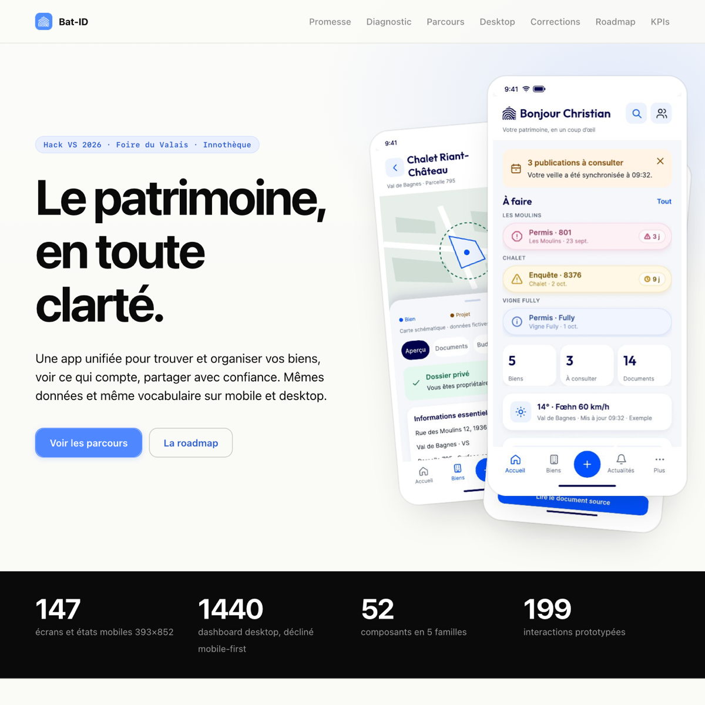
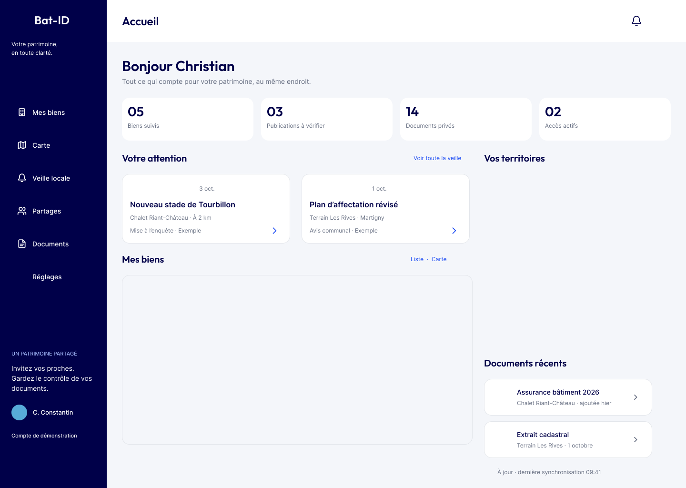

# Bat-ID — Le patrimoine, en toute clarté.

Livrable d'équipe pour le **Hack VS 2026** (Foire du Valais, Espace Innothèque, 3–4 octobre 2026).

Challenge : *« Comment optimiser l'application Bat-ID pour offrir une expérience plus ergonomique et immersive ? »*

## Voir le livrable

Le livrable est un **fichier HTML autonome** (CSS + JS embarqués, aucune dépendance) :

- **En local :** ouvrez `index.html` dans un navigateur (double-clic suffit).
- **Prototype mobile cliquable :** ouvrez `demos/Bat-ID-mobile-prototype.html` dans un navigateur.
- **En ligne :** activez GitHub Pages sur la branche `main` (racine) → `https://aa-augsburger.github.io/hack-vs-bat-id/`.

| Fichier | Description |
|---|---|
| `index.html` | Livrable final : diagnostic, parcours mobile + desktop, corrections, roadmap, KPIs |
| `demos/Bat-ID-mobile-prototype.html` | Prototype mobile cliquable (autonome) |
| `docs/maquettes/desktop.pdf` | Maquettes desktop (109 pages, version compressée) |
| `docs/maquettes/mobile.pdf` | Maquettes mobile (170 pages) |
| `docs/cahier-des-charges.md` | Cahier des charges du challenge |
| `assets/icons/` | Icône de l'équipe (PNG + ICNS macOS) |

## Contexte

[Bat-ID](https://bat-i.ch) est une application suisse pour les propriétaires immobiliers (écosystème Bat-i) : suivi de parcelles, zones d'alerte, notifications du Bulletin officiel, documents du bien, partages sécurisés, espaces partagés.

Deux offres :

- **Découverte** (gratuit) : publications de sa commune, sans suivi personnalisé.
- **Averti** (suivi) : suivi des biens, zones d'alerte et espaces partagés.

Cadre imposé : pas de refonte, fonctions conservées, inscription hors périmètre, cohérence desktop + mobile en fil rouge.

## Contenu du livrable

- **Promesse** — une app pensée autour des actions : parcours simplifiés, information hiérarchisée, droits explicites.
- **Diagnostic (F1–F6)** — statut illisible, perte de contexte document → alerte, 5 portes d'ajout sans conseil, états documents muets, contrat de partage implicite, réglages et push silencieux. Illustré par le parcours de Marthe, 58 ans.
- **Prototype en 8 chapitres (A–H)** — accueil, biens et dossier, veille locale et publication, carte, ajout d'un bien en 3 temps, documents, partages, compte et réglages. Données fictives : Christian, Chalet Riant-Château, parcelle 795, Verbier.
- **Desktop 1440** — même vocabulaire, mêmes données, sidebar fixe et tableaux ; 11 écrans cliquables.
- **Corrections M1–M4** — statut avec contexte (« 3 à consulter : projet voisin, J-3 »), lien « Voir l'alerte d'origine », onboarding segmenté Découverte/Averti, réglages hiérarchisés.
- **Pistes O13–O22** — ajout sans n° de parcelle, visiteur Découverte, contrat d'invitation en une phrase, push coupé expliqué, carte d'offre, concierge, géoinfo Nendaz…
- **Roadmap 12–18 mois** — Phase 1 hygiène (M1, M2), Phase 2 engagement, Phase 3 différenciation.
- **KPIs** — complétion d'ajout, retours au contexte, réouverture J30, adoption Averti.

---

*Hack VS 2026 — Foire du Valais, Innothèque.*
